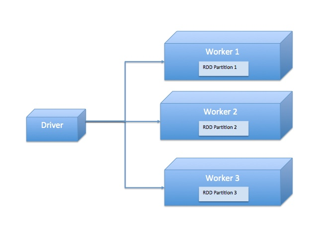
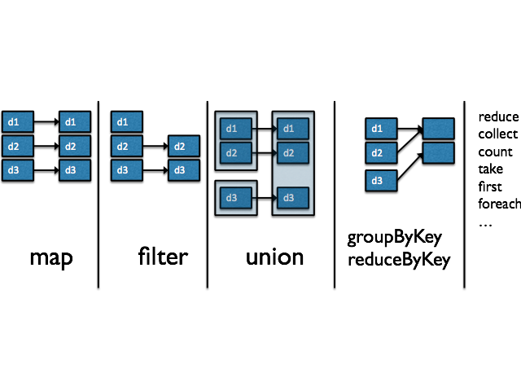
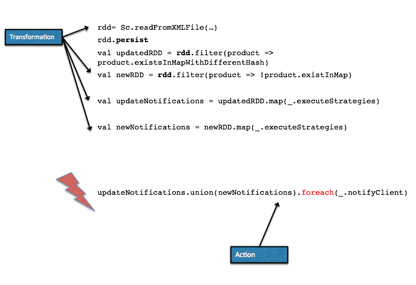

# Partie 2 : Mise en oeuvre des RDDs


Les RDDs sont une collection d'objets immuables répartis sur plusieurs noeuds d'un cluster. Un RDD est créé à partir d'un source de données ou d'une collection d'objets Scala / Python ou Java.


Les opérations disponibles sur un RDD sont :
+ La création
+ Les transformations
+ L'action



Le RDD peut subir des transformations successives au travers de fonctions similaires à celles présentes dans les collections "classiques. on peut citer par exemple :

+ ``map``: renvoie un nouveau RDD avec application d'une fonction de transformation sur chacun des objets du RDD initial
+ ``filter``: renvoie un nouveau RDD qui contiendra un sous ensemble des données contenues dans le RDD initial.

Les opérations de création et de transformation de RDDs ne déclenchent aucun traitement sur les noeuds du cluster. Seul le driver est sollicité. Le driver va construire un graphe acycilique dirigé des opérations qui seront être exécutées sur le cluster au moment de l'application d'une action.

Le cycle de vie d'un RDD est donc le suivant :
```scala
1. rdd1 = création du RDD à partir d'une source de données ou d'une collection
2. rdd2 = rdd1.tranform1(fonctionDeTransformationAAppliquerSurChaqueElement)
3. rdd3 = rdd2.tranform2(fonctionDeTransformationAAppliquerSurChaqueElement)
4. ...
5. ...
6. ...
7. rddn = rddm.tranform3(fonctionDeTransformationAAppliquerSurChaqueElement)
8. objet = rddn.action
```
Une seule action peut être appliquée. Elle consiste à exécuter une opération sur tous les noeuds du cluster et à renvoyer le résultat au driver. L'action peut ne produire aucun résultat, l'action ``foreach``par exemple,ou produire un résultat qui soit un objet ou une collection. On peut citer en exemple :
+ ``reduce``qui renvoie un objet unique (Equivalent à  [Java reduce]() et [Scala reduce](http://www.scala-lang.org/api/2.11.4/index.html#scala.collection.immutable.List))
+ ``take``qui renvoie les n premiers éléments d'un RDD (Equivalent à  [Java take]() et [Scala take](http://www.scala-lang.org/api/2.11.4/index.html#scala.collection.immutable.List))



## Création d'un RDD
Un RDD peut être créé à partir d'une collection ou d'une source de données.

### Création à partir d'une collection

```scala
val rdd1 : RDD[Int] = sc.paralellize(List(1, 2, 3, 4))
val rdd2 : RDD[Int] = sc.paralellize(List("Hello", "Distributed", "World"))
val rdd3 : RDD[Int] = sc.paralellize(1 until 1000000)
```

### Création à partir d'une source de données
```scala
val lines1 : RDD[String] = sc.textFile("hdfs://....")
val lines2 : RDD[(String,String)] = sc.wholeTextFiles("file://path/")

// Création à partir d'une base de données JDBC
def connect() = {
  Class.forName("org.postgresql.Driver").newInstance()
  DriverManager.getConnection("jdbc:postgresql://localhost/mogobiz")
}
def readRecord(res : ResultSet) : (Long, String) = (res.getLong(1), res.getString(2))

val jdbcInputRDD = new JdbcRDD(sc, connect, "select age, name from Account offset ? limit ?", lowerBound = 100, upperBound= 20000, 
                               numPartitions = 10, mapRow = readRecord)

```

``textFile`` et ``wholeTextFile`` permettent de créer un RDD à partir d'un fichier unique ou d'un répertoire. Dans ce deuxième cas, tous les fichiers présents dans le répertoire seront chargés.

+ ``textFile`` va créer un RDD dont chaque élément correspond à une ligne du fichier
+ ``wholeTextFile`` va créer un RDD dont chaque élément contiendra le nom du fichier (la clef: premier élément du tuple) et le contenu du fichier en entier (la valeur : deuxième élément du tuple). cette méthode est adaptée lorsqu'une ligne du fichier ne correspond pas à un enregistrement, cela concerne notamment les fichiers JSON et XML par exemple.

##Transformations d'un RDD

La ligne ci-dessous récupère exclusivement les noms des personnes majeures.
```scala
val namesRDD : RDD[String]= jdbcInputRDD.filter(tuple => tuple._1 >= 18).map(_._2)
```

Nous pouvons trier les utilisateurs par ordre croissant en utilisant la méthode `òrderBy``
```scala
val sortedNamesRDD = namesRDD.sortBy(x => x)
```

## Actions sur un RDD
Une fois l'action exécutée, l'ensemble des données résultant de cette action est rapatriée sur le driver. L'action est celle qui déclenche l'exécution sur les noeuds du cluster de la création, de la transformation, de l'action et du rapatriement des données issues des calculs sur le driver.

L'action ci-dessous récupère les 10 premiers noms
```Scala
val firstNames : Array[String] = sortedNamesRDD.take(10)
```
L'exemple ci-dessus illustre bien que l'action conditionne le début et la fin de l'exécution du traitement sur les noeuds du cluster.

Un opération sur un RDD est une action lorsqu'elle ne renvoie pas de RDD mais qu'elle renvoie un objet ou une collection Scala standard.

Certaines actions peuvent ne rien renvoyer du tout, comme cela est le cas pour l'action ``foreach``.


###Exercice 1 : Mise en oeuvre des RDDs

```scala
  def main(args: Array[String]): Unit = {
    val conf = new SparkConf().setAppName("Workshop").setMaster("local[*]")
    // Fichier de rating au format userid\tmovie\trating\ttimestamp
    val url = Paths.get(getClass.getResource("/ratings.txt").toURI).toAbsolutePath.toString
    val sc = new SparkContext(conf)

    // Charger le fichier de ratings dans un RDD
    // calculer la moyenne, le min, le max et le nombre d'éléments pour l'utilisateur avec l'id 200
    // ...

    println( s"""
    count=$count
    min=$min
    mean=$mean
    max=$max
      """)
  }
}

```

## Le cache
Considérons l'exemple ci-dessous :
```scala
1. val lines = sc.textFile("...")
2. lines.count() // renvoie le nombre de lignes
3. lines.map(_.length).sortBy(x=> -x, ascending = false).first()
```

Dans l'exemple ci-dessus le fichier sera lu deux fois, une première fois à l'exécution de l'action ``count``et une seconde fois à l'action ``first``qui renvoie le premier élément du RDD (la ligne la plus longue).
```
// On rajoute l'appel à persist qui indique à Spark que le RDD ne doit pas être ``déchargé`` suite à l'exécution de l'action qui va suivre.
val lines = sc.textFile("...").persist(StorageLevel.MEMORY_AND_DISK)

lines.count() // renvoie le nombre de lignes
lines.map(_.length).sortBy(x=> -x, ascending = false)

// Le RDD est supprimé du cache.
lines.unpersist()

```

###Exercice 2
```scala
object Workshop2 {

  def main(args: Array[String]): Unit = {
    val conf = new SparkConf().setAppName("Workshop").setMaster("local[*]")
    val url = getClass.getResource("/ratings.txt").toString.replace("%20", " ")
    val sc = new SparkContext(conf)

    // Charger le fichier de ratings dans un RDD
    // Cacher le RDD de l'utilisateur avec l'id 200
    // calculer la moyenne, le min, le max et le nombre d'éléments pour l'utilisateur avec l'id 200
    // Libérer du cache


    println( s"""
     count=$count
     min=$min
     mean=$mean
     max=$max
       """)

  }
}
```


## Les Pairs RDD
Spark offre des fonctionnalités spécifiques aux RDD clef-valeur - ``RDD[(K,V)]``. Il s'agit notamment des fonctions ``groupByKey, reduceByKey, mapValues, countByKey, cogroup``, 
https://spark.apache.org/docs/1.3.0/api/scala/index.html#org.apache.spark.rdd.PairRDDFunctions

###Exercice 3
```
 // Combien de fois chaque utilisateur a voté
  def main(args: Array[String]): Unit = {
    val conf = new SparkConf().setAppName("Workshop").setMaster("local[*]")
    val url = Paths.get(getClass.getResource("/ratings.txt").toURI).toAbsolutePath.toString
    val sc = new SparkContext(conf)

    // Charger le fichier de ratings dans un RDD
    // ...
    // Créer un RDD clef/valeur [userid, rating]
    // ...
    // Mettre le RDD en cache
    // ...
    // Calculer le nombre de paires
    // ...
    println(s"Count=$count")
    // Calculer le nombre d'utilisateur distincts
    // ...
    println(s"UserCount=$userCount")

    // Calculer la somme des ratings / utilisateur
    // ...
    // Calculer le nombre de ratings par utilisateur
    // ...
    // Calculer la plus faible note donnée par chaque utilisateur
    // ...
    // Calculer la plus forte note donnée par chaque utilisateur
    // Mettre l'ensemble des RDDs dans un RDD unique (union) sans écraser les valeurs. (allRDDs)
    // ...
    // Indice : Modifier les transformations précédentes pour avoir un tuple avec une seule valeur significative
    // ...
    // Réaliser une variante en utilisant cogroup
    // ...


    // ----> Ne fonctionnera pas
    //    cachedRDD.map { userRatings =>
    //      val user = userRatings._1
    //      val ratings = sc.makeRDD(userRatings._2)
    //      ratings.map(_.rating).mean()
    //    }

    allRDDs.foreach { case (x, y) =>
      println( s"""
     user=$x
     count=${y._4}
     min=${y._1}
     mean=${y._2}
     max=${y._3}
       """)
    }
    val sqlContext: SQLContext = new org.apache.spark.sql.SQLContext(sc)
    import sqlContext.implicits._

    lines.toDF().registerTempTable("ratings")
    val maxRatings: DataFrame = sqlContext.sql("SELECT user, rating from ratings where rating = 5")
    //maxRatings.map(row => row(0) + "=" + row(1)).collect().foreach(println)

  }
}

```
