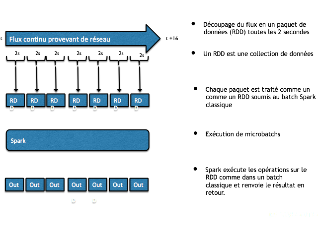

# Partie 4 : Spark Streaming




Spark Streaming offre la reprise sur erreur vie la méthode ``checkpoint``.
En cas d'erreur, Spark Streaming repartira du dernier checkpoint qui devra avoir été fait sur un filesystem fiable (tel que HDFS).
Le checkpoint doit être fait périodiquement. La fréquence de sauvegarde a un impact direct sur la performance. En moyenne on sauvegardera tous les 10 microbatchs.

Les opérations sur les DStreams sont stateless, d'un batch à l'autre, le contexte est perdu. Spark Streaming offre deux méthodes qui permettent un traitement stateful : ``reduceByWindow`` et ``reduceByKeyAndWindow``
qui vont conserver les valeurs antérieures et permettent de travailler sur une fenêtre de temps multiples de la fréquence de batch paramétrée.

Dans l'exemple ci-dessous, on affiche toutes les 20s le nombre de mots enovyés dans la minute.

```scala
object Workshop9 {
  def main(args: Array[String]): Unit = {
    val conf = new SparkConf().setAppName("Workshop").setMaster("local[*]")
    val ssc = new StreamingContext(conf, Seconds(1))
    ssc.checkpoint("/tmp/spark")
    val lines: ReceiverInputDStream[String] = ssc.socketTextStream("localhost", 7777)
    val res: DStream[Int] = lines.flatMap(x => x.split(" ")).map(x => 1).reduceByWindow(_ + _, _ - _, Seconds(60), Seconds(20))
    res.checkpoint(Seconds(100))
    res.foreachRDD(rdd => rdd.foreach(println))
    res.print()

//    lines.print()
    ssc.start()
    ssc.awaitTermination()
  }
}

```


Pour tester le streaming, il nous faut un serveur de test. 
Sur macos, il suffit de lancer ``ncat`` avec la commande ``nc`` et taper des caractères en ligne de commande qui seront alors retransmis sur le port d'écoute ncat :
```sh
$ nc -l localhost 7777
Hello World ++
Hello World ++
Hello World ++
Hello World ++
^C
```

Sur Windows, ``ncat`` peut être téléchargé sur [nmap.org](https://nmap.org/ncat/)


###Exercice 7 : Opérations stateful avec Spark Streaming
Objectif : Compter le nombre d'occurrences de chaque mot par période de 30 secondes
object Workshop7 {
  def main(args: Array[String]): Unit = {
    val conf = new SparkConf().setAppName("Workshop").setMaster("local[*]")
    val ssc = new StreamingContext(conf, Seconds(1))
    ssc.checkpoint("/tmp/spark")
    val lines: ReceiverInputDStream[String] =    ssc.socketTextStream("localhost", 7777)
    
    // Compter le nombre d'occurrences de chaque mot par période de 30 secondes
    val res: DStream[(String, Int)] = ...
    
    res.checkpoint(Seconds(100))
    res.foreachRDD(rdd => rdd.foreach(println))
    res.print()

//    lines.print()
    ssc.start()
    ssc.awaitTermination()
  }
}
